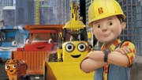

= Bob: the builder

== 简介

《巴布工程师》（Bob the Builder）是英国的一个儿童图书和动画片系列，英国BBC于1999年开始播出的著名卡通节目。在英国的学前教育节目评级中获得最高的级别。巴布在德国学前儿童教育节目中排第2位。在英国被确认为是学龄前儿童最喜欢的的角色。在美国、日本、德国、澳大利亚等国家收视率排第一。故事讲的是在一座美丽的小镇上，生活着名叫巴布（Neil Morrissey 配音）的建筑工程师，他热情正直，善良可亲，其出 色的建筑本领更是为镇上的人们所称道。巴布和温蒂共同经营者建筑王国，他们有很多得力的助手：红色推土机马克、黄色推土/挖土机耍酷、吊车小芙、压路机罗利、搅拌机狄丝，这些小伙伴在巴布的带领下共同建设着这座美好的城市，并且在这一过程中，也发生着各种各样有趣的事情。

== 亮点

他们的口号是：“我们行不行？（Can We Fix It?）”“我们一定行！（Yes, We Can!）”

== 片源

* 中央少儿频道
* 腾讯视频
* Youtube

== 参考

* https://www.jianshu.com/p/114ab44fc40e
