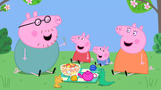

= Peppa Pig

== 简介

《小猪佩奇》（Peppa Pig）由英国阿斯特利贝加戴维斯创作、导演和制作。故事围绕一只名叫佩奇的女孩小猪以及她的家庭和朋友展开，幽默而有趣，藉此宣扬传统家庭观念与友情，鼓励小朋友们体验生活。共95集，每集长度约5分钟。

== 亮点

极简的动画风格，幽默的对话语调，深具教育意义的故事情节，不仅能让学龄前儿童学习知识，更能让小朋友们从小养成良好的生活习惯体验生活。

== 片源

* 央视播出过四季
* 腾讯视频
* YouTube

== 参考

* https://www.jianshu.com/p/114ab44fc40e
